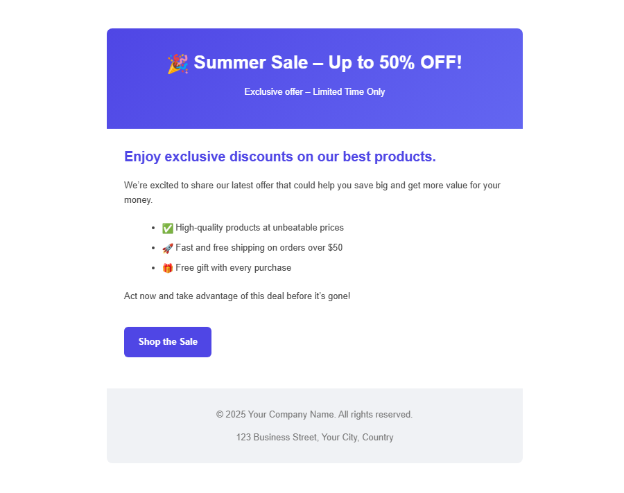

# 📧 Laravel 10 Bulk Offer Email Sender

Send promotional or sale emails to multiple recipients at once using **Laravel 10**.  
Emails are entered **comma-separated**, with customizable **title, body, button text, and link**.

You can **use the code directly** in your project — controller, routes, and mail class are ready.

---

## 🚀 Features

- Send **bulk emails** via SMTP (Gmail or any SMTP provider)  
- Dark-themed, modern form for sending emails  
- Customizable title, body, button text, and link  
- Works out-of-the-box with Laravel 10  

---
### Form UI


### Success Message


### Email Template


## 📦 Installation

```bash
git clone https://github.com/yourusername/laravel-offer-bulk-email.git
cd laravel-offer-bulk-email
composer install
cp .env.example .env
php artisan key:generate

---


⚙️ Configuration

Edit .env:

MAIL_MAILER=smtp
MAIL_HOST=smtp.gmail.com
MAIL_PORT=465
MAIL_USERNAME=yourgmail@gmail.com
MAIL_PASSWORD=your_app_password
MAIL_ENCRYPTION=ssl
MAIL_FROM_ADDRESS=yourgmail@gmail.com
MAIL_FROM_NAME="${APP_NAME}"

Use a Gmail App Password for MAIL_PASSWORD.

🛠 Usage

Start Laravel server:

php artisan serve


Visit:

http://127.0.0.1:8000


Enter emails, customize offer, and click Send Emails.

All required code is ready — no extra setup needed.

🏃 Notes

Gmail free accounts limit sending (~500/day).

For 100+ recipients regularly, use Mailgun, SendGrid, or SES.

Laravel Queues can help with large batches.

## 💼 Hire Me

I’m Md. Rifat Hossain, a Laravel Developer specializing in email automation, web applications, and business software.
If you need custom Laravel development, you can reach me at:

📧 rifatakhon@gmail.com

💻 Available for freelance & remote work.